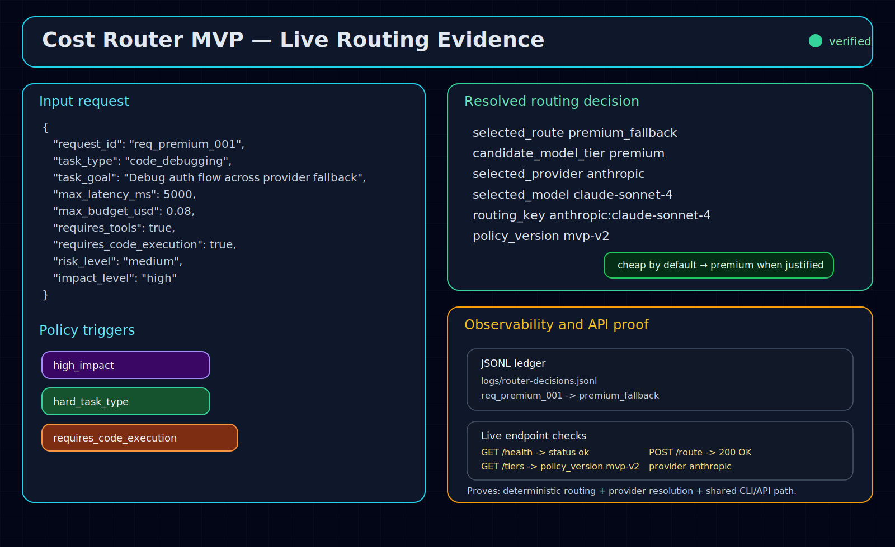
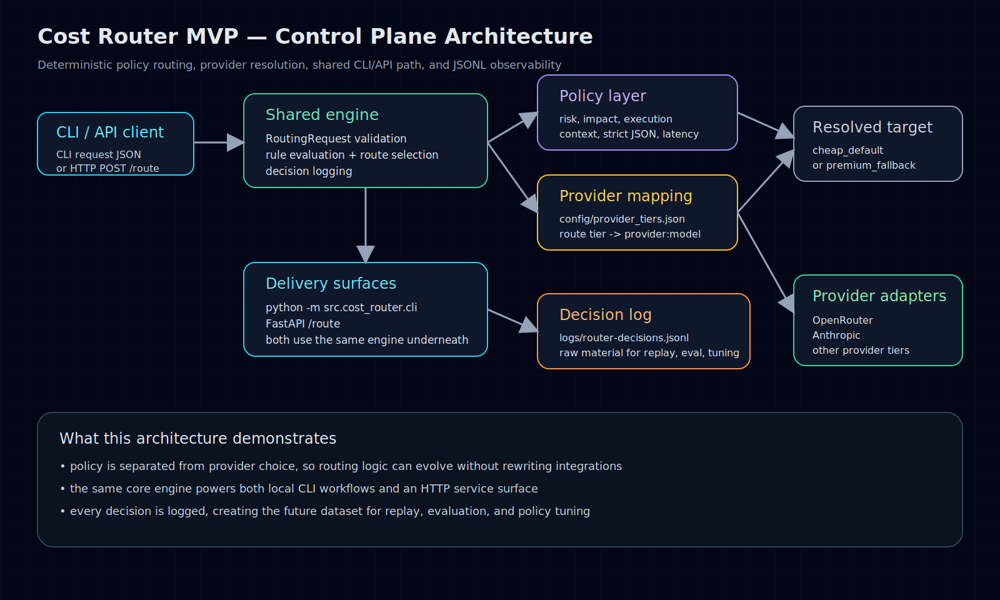

# Cost Router MVP

A logging-first control-plane MVP for routing agent workloads to the *cheapest acceptable model path* by default, with deterministic escalation to a premium fallback when risk, complexity, or execution requirements justify it.

> **Start here:**
> - [Recruiter-facing case study](docs/portfolio-case-study.md)
> - [Routing schema and rules](docs/input-schema-and-routing-rules.md)
> - [Architecture diagram](evidence/diagrams/cost-router-architecture.svg)

This project is intentionally small, but it demonstrates an important product/system idea: **model choice is commoditizing, while routing policy, observability, and control-plane logic are where leverage compounds.**

## Visual evidence

### Live routing evidence



### Control-plane architecture



## Why this project matters

Most AI apps still hard-code one model per workflow.

That leaves money on the table in two directions:
- **overspending** on simple tasks that could run on a cheaper tier
- **underpowering** high-stakes tasks that need stronger reasoning or execution reliability

This MVP is the first layer of a better pattern:
- classify the job
- apply explicit routing policy
- resolve to a provider/model target
- log every routing decision
- create the dataset needed for later evaluation and policy tuning

## What this version does

- accepts a task request as JSON
- validates a stable input schema
- applies deterministic routing rules
- chooses between `cheap_default` and `premium_fallback`
- resolves that route into an actual provider/model target from config
- writes every routing decision to a local JSONL ledger
- exposes the same logic through both a CLI and a tiny FastAPI service

## What this version does not do yet

- call real model providers
- estimate actual tokens from prompts/responses
- score output quality automatically
- learn policy thresholds from historical outcomes
- run live retries or fallback execution loops

## Architecture

```text
request json
   ↓
schema validation
   ↓
policy rules
   ↓
route tier decision
   ↓
provider/model resolution
   ↓
jsonl decision log
   ↓
cli output or http response
```

Core idea:
- keep the **routing brain** pure and deterministic
- keep **provider mapping** configurable
- keep **delivery surfaces** thin (`cli` and `FastAPI`)

## Routing policy today

The router escalates to `premium_fallback` when any of these are true:
- user explicitly overrides to premium
- task risk is high
- task impact is high
- task type is inherently harder
- task requires code execution
- task needs long context
- strict JSON is required for critical structured tasks
- latency budget is tight for a complex task class

Otherwise it routes to `cheap_default`.

## Provider/model tier mapping

The route tier is resolved through `config/provider_tiers.json`.

Current defaults:
- `cheap_default`
  - provider: `openrouter`
  - model: `mistralai/mistral-small-3.1`
- `premium_fallback`
  - provider: `anthropic`
  - model: `claude-sonnet-4`

This keeps policy separate from vendor choice.

## API surface

### CLI

Cheap-path example:

```bash
cd /opt/data/workspace/cost-router-mvp
python3 -m src.cost_router.cli examples/simple-task.json
```

Premium-path example:

```bash
python3 -m src.cost_router.cli examples/premium-task.json
```

Custom config path:

```bash
python3 -m src.cost_router.cli examples/simple-task.json --config-path config/provider_tiers.json
```

### FastAPI service

This repo was verified locally using the Hermes runtime, which already includes FastAPI and uvicorn:

```bash
cd /opt/data/workspace/cost-router-mvp
/opt/hermes/venv/bin/python -m uvicorn src.cost_router.app:app --host 127.0.0.1 --port 8000
```

If you are running this outside the Hermes environment, install the API deps with:

```bash
pip install -r requirements.txt
```

Health check:

```bash
curl http://127.0.0.1:8000/health
```

Route a request:

```bash
curl -X POST http://127.0.0.1:8000/route \
  -H 'Content-Type: application/json' \
  --data @examples/premium-task.json
```

List configured tiers:

```bash
curl http://127.0.0.1:8000/tiers
```

## Example decision output

```json
{
  "request_id": "req_premium_001",
  "selected_route": "premium_fallback",
  "candidate_model_tier": "premium",
  "selected_provider": "anthropic",
  "selected_model": "claude-sonnet-4",
  "provider_routing_key": "anthropic:claude-sonnet-4",
  "policy_version": "mvp-v2",
  "reasons": [
    "high_impact",
    "hard_task_type",
    "requires_code_execution"
  ],
  "estimated_cost_bucket": "medium",
  "estimated_latency_bucket": "medium",
  "logged_at": "2026-05-03T00:00:01Z"
}
```

## Local decision log

Every route decision is appended to:
- `logs/router-decisions.jsonl`

This is the raw material for future work:
- replay/evaluation harnesses
- routing threshold tuning
- cost/latency analytics
- outcome-linked policy learning

## Project structure

- `config/provider_tiers.json` — provider/model tier mapping
- `docs/input-schema-and-routing-rules.md` — schema, policy, and API contract
- `docs/portfolio-case-study.md` — recruiter-facing build narrative
- `src/cost_router/models.py` — request/decision models
- `src/cost_router/router.py` — routing rules and target resolution
- `src/cost_router/config.py` — tier config loading
- `src/cost_router/engine.py` — shared request-processing path
- `src/cost_router/cli.py` — local CLI interface
- `src/cost_router/app.py` — FastAPI wrapper
- `tests/test_router.py` — zero-dependency unit tests for core logic
- `evidence/screenshots/` — live demo artifacts
- `evidence/diagrams/` — architecture visuals
- `logs/router-decisions.jsonl` — ignored runtime ledger

## Verification

Run unit tests:

```bash
python3 -m unittest discover -s tests -v
```

## Portfolio angle

This is not just “another LLM wrapper.”

It shows:
- control-plane thinking
- explicit reasoning about cost vs latency vs task quality
- clean separation between policy and provider bindings
- observability-first design
- a realistic path from heuristic routing to learned routing

That is exactly the kind of systems/product judgment employers want to see in agent infrastructure work.

## Next steps

1. add prompt/token estimation
2. plug in live provider adapters
3. capture outcome quality and retry behavior
4. build a replay/eval harness over logged requests
5. learn routing policy from observed performance instead of rules alone
